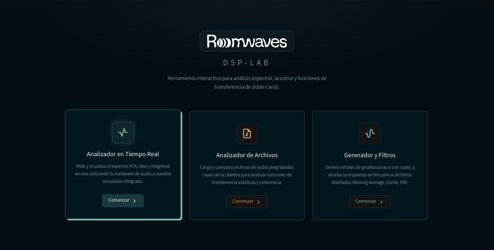
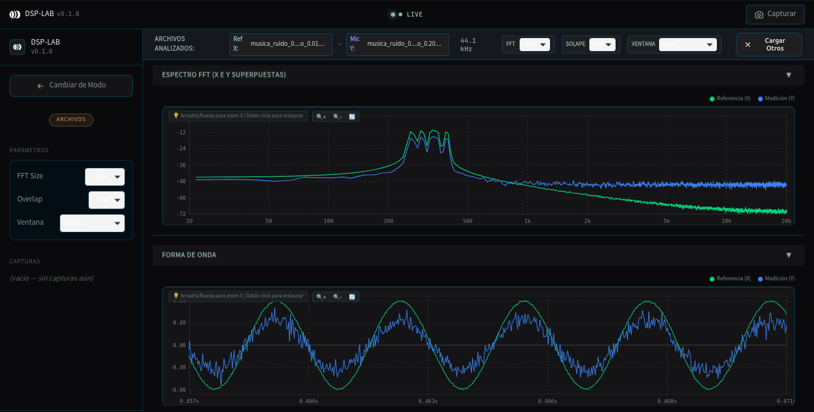

# Analizador de Procesamiento Digital de Señales (DSP Lab)

Este repositorio contiene el entorno integrado para el modelado, filtrado e identificación de sistemas de procesamiento digital de señales (DSP). La arquitectura del proyecto está estructurada como un monorepo que consta de un motor matemático en Python, un servicio backend en FastAPI para la exposición de endpoints numéricos, y una interfaz de usuario interactiva multiplataforma desarrollada en Tauri y Vue 3.

---

### Pantalla de Inicio


### Ejemplo de Análisis de Señales y Coherencia Espectral


---

## 📂 Estructura del Repositorio

* **`faculty/`**: Contiene los entregables académicos del proyecto (Jupyter Notebooks, reportes técnicos y funciones de simulación).
  * **`faculty/preentrega/`**: Primera entrega (Parte 1: generación de señales, convolución en tiempo/frecuencia y análisis de filtros).
  * **`faculty/final/`**: Entrega final (Parte 2: caracterización e identificación de sistemas desconocidos y coherencia espectral).
* **`core/dsp/`**: Motor numérico puro implementado en Python (cálculo de transformadas de Fourier, diseño de filtros FIR/IIR y estimaciones espectrales).
  * **`core/dsp/tests/`**: Suite de pruebas unitarias automatizadas para la validación de los algoritmos y la precisión matemática.
* **`apps/api/`**: Servidor FastAPI que actúa como puente de comunicación, exponiendo el motor de cálculo en Python mediante una interfaz HTTP.
* **`apps/desktop/`**: Interfaz de escritorio multiplataforma (HTML/CSS/TS/Vue 3 y Tauri v2) para el análisis dinámico.

---

## 🛠️ Instrucciones de Configuración y Evaluación

El entorno puede evaluarse e interactuarse mediante dos vías independientes, de acuerdo al nivel de profundidad y alcance requerido:

---

### Vía A: Evaluación del Núcleo Matemático y Reportes (Jupyter Notebooks & Python Core)

*Orientado a la verificación de los desarrollos teóricos, ecuaciones de filtrado, análisis de coherencia espectral y validación del motor numérico sin necesidad de compilar la interfaz de usuario.*

Esta vía requiere únicamente una instalación estándar de Python (versión 3.11 o superior). No requiere compiladores de Rust ni gestores de dependencias web.

#### 1. Aislamiento del Entorno de Ejecución
Abra una terminal, clone el repositorio y acceda a la carpeta raíz:
```bash
git clone https://github.com/Roomwaves/dsp-lab.git
cd TP-DSP
```

Inicialice y active un entorno virtual (`venv`):
* **En Windows (cmd):**
  ```cmd
  python -m venv .venv
  .venv\Scripts\activate.bat
  ```
* **En Windows (PowerShell):**
  ```powershell
  python -m venv .venv
  Set-ExecutionPolicy -ExecutionPolicy RemoteSigned -Scope Process
  .venv\Scripts\Activate.ps1
  ```
* **En macOS / Linux:**
  ```bash
  python3 -m venv .venv
  source .venv/bin/activate
  ```

#### 2. Instalación de Dependencias
Instale el paquete de DSP local en modo desarrollo/editable junto con los paquetes necesarios para la simulación:
```bash
pip install --upgrade pip
pip install -e .
pip install jupyter pytest
```

#### 3. Acceso a los Notebooks Académicos
Inicie el entorno interactivo de Jupyter:
```bash
jupyter notebook
```
A través del navegador web, acceda al directorio `faculty/` para examinar el desarrollo y las celdas de simulación:
* **Preentrega (Parte 1):** [faculty/preentrega/notebook.ipynb](faculty/preentrega/notebook.ipynb) (funciones de soporte en [faculty/preentrega/functions.py](faculty/preentrega/functions.py)).
* **Entrega Final (Partes 1 y 2):** [faculty/final/notebook.ipynb](faculty/final/notebook.ipynb) (funciones de soporte en [faculty/final/functions.py](faculty/final/functions.py)).

#### 4. Validación Matemática Automatizada
El núcleo del sistema cuenta con pruebas unitarias (`pytest`) que aseguran la consistencia numérica de las operaciones matemáticas de filtrado, generación de señales y coherencia espectral en [core/dsp/tests/](core/dsp/tests/). Para ejecutarlas, corra:
```bash
pytest
```

---

### Vía B: Ejecución del Sistema Completo (Aplicación de Escritorio & API)

*Orientado a la experimentación interactiva de la herramienta completa, permitiendo la manipulación dinámica y en tiempo real de las señales y espectros generados.*

#### Requisitos Previos
* **Node.js (v20 o superior)**.
* **Rust (rustup)** y herramientas de compilación nativas de C++ (Build Tools para Visual Studio en Windows).
* **Python (v3.11 o superior)**.
* **uv** (opcional, administrador de paquetes de Python rápido).

#### Flujo de Ejecución

1. **Instalación de Dependencias Generales:**
   ```bash
   # Configuración del entorno de Python
   uv sync  # o bien "pip install -e ." con el entorno virtual activo
   
   # Configuración del entorno frontend
   cd apps/desktop
   npm install
   cd ../..
   ```

2. **Inicialización del Backend de Cálculo (FastAPI):**
   Inicie la API de cálculo (por defecto en localhost:8000) ejecutando en su terminal:
   ```bash
   npm run api:dev
   ```
   *(Nota: Alternativamente, si dispone de Docker, puede levantar el servicio mediante `npm run docker:up`)*

3. **Inicialización del Cliente Gráfico (Tauri + Vue 3):**
   Abra una **nueva terminal** (manteniendo el backend activo), asegúrese de activar su entorno virtual de Python y ejecute:
   ```bash
   npm run dev
   ```
   El motor de compilación generará la interfaz y abrirá automáticamente la ventana nativa de escritorio del analizador.

---

## 👥 Integrantes

* Ferreyra, Florencia
* Gonzalez, Tomás
* Molina, Lara
* Scafati, Jerónimo

---

## 📄 Licencia

Este proyecto se distribuye bajo la licencia PolyForm Noncommercial 1.0.0. No se permite el uso comercial sin autorización previa.